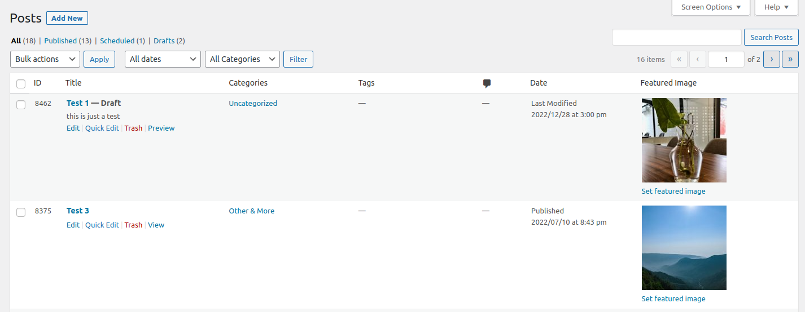

# Default Admin Posts Order #
**Contributors:** [gregross](https://profiles.wordpress.org/gregross/)  
**Plugin URI:** http://toolstack.com  
**Author URI:** http://toolstack.com  
**Tags:** admin posts order  
**Requires at least:** 3.5  
**Tested up to:** 6.1  
**Requires PHP:** 7.0  
**Stable tag:** 1.0  
**License:** GPLv2  

Adds the ID to the admin posts list and sets it to the default sort order.

## Description ##

WordPress sorts the posts list by posted date (if still a draft this becomes the modified date) and does not included the post ID in the column list.  This is fine for most use cases, however sometimes you want to sort by creation date, while there is no way to do that as the creation date is not included in the database, the post ID is always incremental so you can sort by that to provide a pseudo creation order.

The plugin will also make this the default sort order for the posts screen.

The plugin only changes the posts screen and does not effect the pages or other custom post types.

## Installation ##

1. Extract the archive file into your plugins directory in the default-admin-posts-order folder.
2. Activate the plugin in the Plugin options.
3. Done!

## Frequently Asked Questions ##

### Are there any options for this plugin ###

No, everything is taken care of automatically.

## Screenshots ##

### 1. Post list with with ID column. ###

## Changelog ##

### 1.0 ###

* Release date: TBD
* Initial release.

## Upgrade Notice ##

None at this time.

## Roadmap ##

* None at this time!
